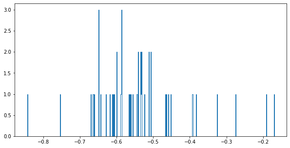
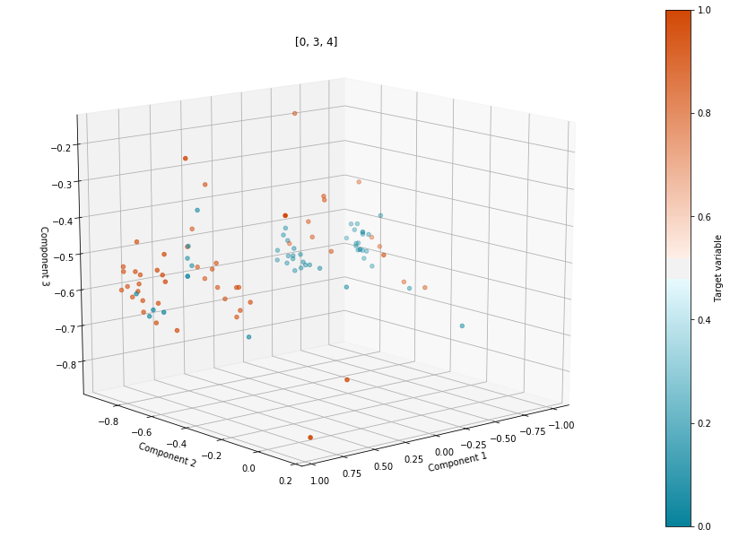
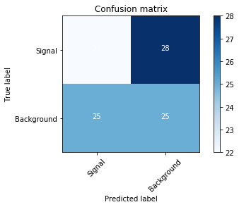

# Machine Learning Part

## Task
You will explore how best to apply machine learning algorithms, for example, Neural Network, Boosted Decision Tree (BDT), Support Vector Machine(SVM) to solve a High Energy Data analysis issue, more specifically,  separating the signal events from the background events.
A set of input samples (simulated with Delphes) is provided in NumPy NPZ format [Download Input]. In the input file, there are only 100 samples for training and 100 samples for testing so it won’t take much computing resources to accomplish this task. The signal events are labeled with 1 while the background sample are labeled with 0.
You can apply one machine learning algorithm to this input but be sure to show that you understand how to fine tune your machine learning model to improve the performance. The performance can be evaluated with classification accuracy or Area Under ROC Curve (AUC).

## Analysis

I have done detailed visualization and analysis of the dataset and applied various models in the dataset.

I have also trained various models for the task of prediction but none of them have produced any satisfactory results, probably because of very few dataset for training. I have plotted ROC-AUC curve and found out the accuracy, precision and recall as well plotted the accuracy matrix for all the models, which is present in the notebook.

## Data Visualization and Exploratory Data Analysis

### Basetrack distributions for background for each column in dataset

### Basetrack distribution for signals for each column in dataset

### 3D visualization for all combinations of components in dataset

## Models Used and description

### DNN 

### XGBClassifier

### AdaBoostClassifier

### GradientBoostingClassifier

### Support Vector Machine

### KNeighborsClassifier

### LogisticRegression

### DecisionTreeClassifier

### RandomForestClassifier

