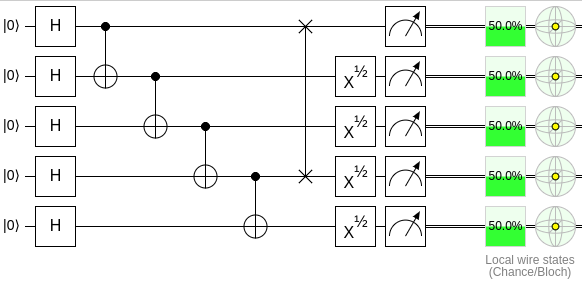
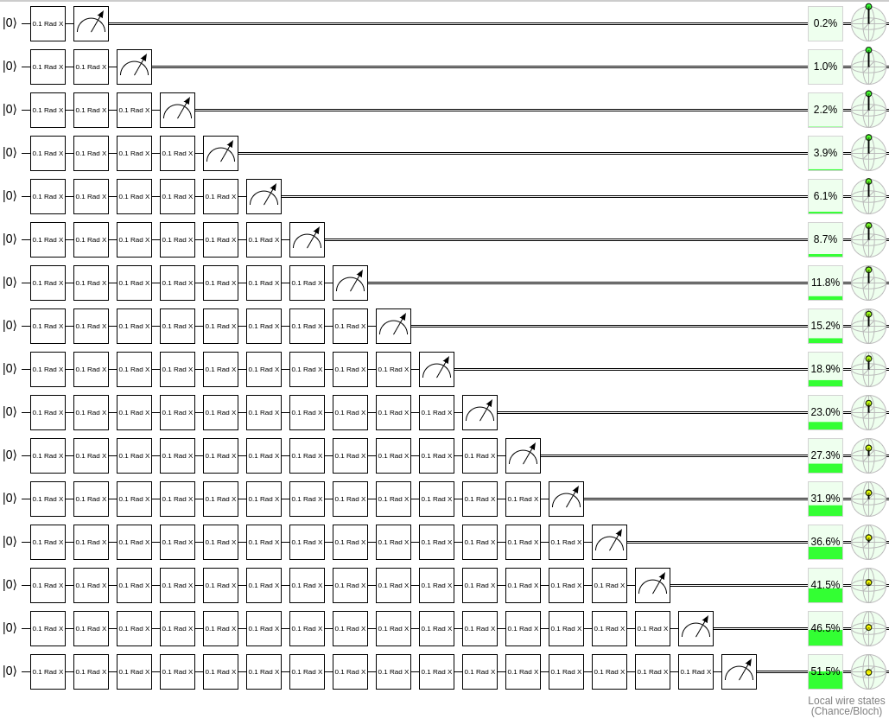
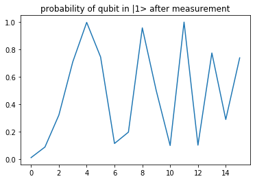
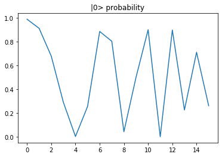

# Quantum Computing Part

## Task 1

### Implement a simple quantum operation with Cirq

1. With 5 qubits
2. Apply Hadamard operation on every qubit
3. Apply CNOT operation on (0, 1), (1,2), (2,3), (3,4)
4. SWAP (0, 4)
5. Rotate X with pi/2
6. Plot the circuit

### Circuit Diagram for Task 1

## Task 2

Create a circuit that is a series of small `cirq.Rx` rotations and plot the  probability of measuring the state in the |0⟩ state. For example, for a qubit, at first, you can rotate 0.1 degree, you get one probability of measuring the state in the |0⟩ state; then you rotate another 0.1 degree in addition, you get another probability; then you another 0.1 degree and so on.

### Circuit Diagram for Task 1

### Probility distribution of finding |1> state after mesurement

### Probility distribution of finding |0> state after mesurement

